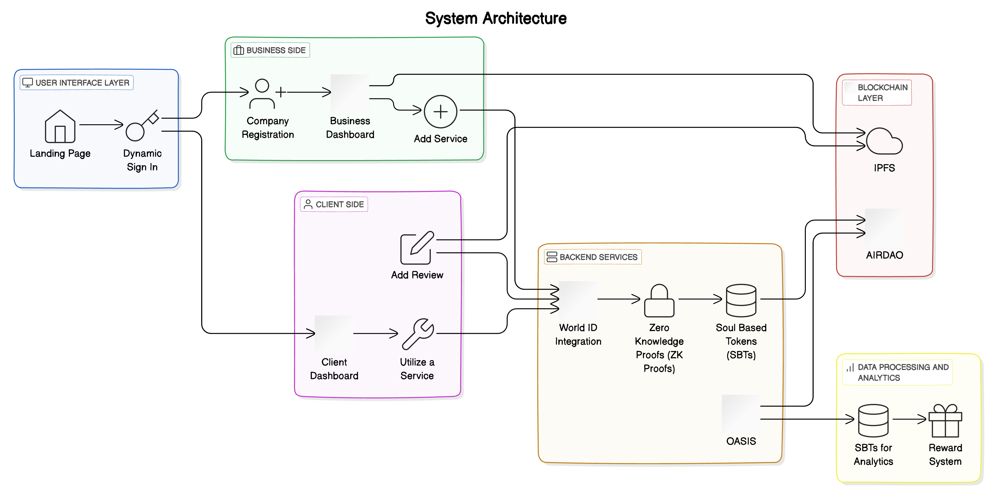

# Introduction

The project aims to create an app to easily & verifiably generate user reviews & ratings which are non editable and  can be used for trustable judgement of the service provided.  We aim to to serve consumers everywhere by providing trustable reviews which allow for fair judgement and Scam Prevention.

We have made two facets to the app. A web app for registering service providers and handling business side and a Mobile App to allow users to easily access available services and add reviews.The web-app contains the business side i.e. the companies aspect. The phone-app is for the users of the services.

The project uses WORLDCOIN's World ID anonymous actions to generate proof of human hood and create  Anonymous Unique Human reviews. Login and identity management is done via DYNAMIC. Then proof of interaction is generated with Zero Knowledge and reviews are stored on chain. We have also deployed on mobile for accessing more user base.

These feedbacks are used to create un-transferable Soul Based Tokens on AIRDAO to make the reviews tamper proof. We have created a new paradigm of co-ownership between the reviewer and the reviewee of SBTs to store and analyze reviews and perform reputation management. These are also further used for reward generation for both the parties.

We have used OASIS to perform private computation on reviews & ratings to generate concise recap for new users. We use Zero Knowledge to endure privacy and security on the review data.

# System Design

The above figure represents our system model.

1. User Interface Layer
   - Landing Page: Entry point for users and businesses.
   - Dynamic Sign In: Handles user authentication and identity management using DYNAMIC.

2. Business Side
   - Company Registration: Allows businesses to register and manage their profiles.
   - Dashboard: Provides an overview of services, ratings, and reviews. Integrates with IPFS for storing reviews and company logos.
   - Add Service: Businesses can add services, verified by World ID to ensure human interaction.

3. Client Side
   - Dashboard: Displays previous reviews and services used by the client.
   - Utilize a Service: Clients can interact with services, generating a proof of interaction.
   - Add Review: Clients can submit reviews, verified by World ID for authenticity.

4. Backend Services
   - World ID Integration: Ensures reviews and service additions are performed by real humans.
   - Zero Knowledge Proofs (ZK Proofs): Used to maintain privacy and security of review data.
   - Soul Based Tokens (SBTs): Reviews are stored as SBTs on AIRDAO, ensuring they are tamper-proof and co-owned by the reviewer and reviewee.
   - OASIS: Performs private computation on reviews to generate concise summaries for new users.

5. Blockchain Layer
   - AIRDAO: Hosts the SBTs, ensuring reviews are immutable and secure.
   - IPFS: Stores review data and company logos for decentralized access.

6. Data Processing and Analytics
   - OASIS: Analyzes reviews and ratings to provide insights and summaries.
   - SBTs for Analytics: Utilize SBTs to track and analyze user interactions and review patterns.
   - Reward System: Generates rewards for both reviewers and reviewees based on interactions and reviews.

System Design Diagram Enhancements
- Flow: Users and businesses interact through the UI, with actions verified by World ID. Reviews are processed with ZK proofs and stored as SBTs on AIRDAO. OASIS handles data processing for insights and rewards, leveraging SBTs for enhanced analytics.

This enhanced architecture ensures a secure, verifiable, and decentralized system for managing reviews and ratings, with added capabilities for data processing and analytics using SBTs.

You can run the sub directories individually to test the code.
